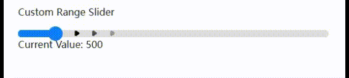

# 1. Custom-Range-Slider
This project is a highly customizable range slider component with dynamic features, ideal for applications requiring an interactive UI. The range-bar supports both mouse and touch input, providing smooth transitions and flexible customization options.

# 2.Features:
### 1.Dynamic Arrow Effects:
Displays animated arrows along the range bar, visually enhancing the 
slider.

### 2.Responsive Design:
Works seamlessly on both desktop and mobile devices.

### 3.Long-Press Controls:
Supports long-press gestures on the range-bar and range-fill to automatically adjust the slider.

### 4.Customizable Step Sizes:
 Allows defining different step sizes across the range.

### 5.Restricted Drag Areas:
 Supports restricted dragging zones, making certain parts of the bar non-draggable.

### 6.Animated Transitions:
Smooth slider animation when jumping to a new value on long-press or 
click.

### 7.Real-time Value Update:
Notifies other components or elements of value changes.

# 3.How to Use:
#### 1.Clone the repository.
#### 2.Customize the range-bar by setting step sizes, restricted zones, and other parameters in the provided configuration.
#### 3.Integrate with your project for a dynamic, interactive range slider.
